# Thor Stack - System Architecture

A local-first, AI-powered workout tracking platform with conversational AI integration.

## High-Level Architecture


## Key Features

### 🎯 Natural Language Processing
**"shoulder press 3x12 @45"** → Structured workout data with sets, reps, and weights

### 🤖 AI-Powered Agent
Conversational interface with tool calling, session management, and context awareness

### 📊 Progress Tracking
Real-time analytics, exercise history, and visual progress charts

### 🔒 Privacy-First Architecture
- **100% Local-First**: All data stored in local SQLite database
- **Choose Your LLM**: Use local Ollama or cloud OpenAI
- **No External Dependencies**: Works completely offline with Ollama

### 📈 Automated Insights
Weekly AI-generated summaries with coaching feedback and trend analysis

### 🔌 MCP Integration
8 tools exposed via Model Context Protocol for AI agent integration

---

## Technology Stack

| Component | Technologies |
|-----------|-------------|
| **Frontend** | HTML, Tailwind CSS, Chart.js, Web Speech API |
| **Agent** | TypeScript, Express, MCP Client |
| **Backend** | TypeScript, Express.js, Node.js |
| **Database** | SQLite (better-sqlite3) with WAL mode |
| **AI/ML** | Ollama (local) or OpenAI (cloud) |
| **Integration** | Model Context Protocol (MCP) |
| **Build System** | npm workspaces, TypeScript, esbuild |
| **Automation** | node-cron for scheduled tasks |

---

## Data Flow: Logging a Workout

```mermaid
sequenceDiagram
    participant User
    participant Agent as Thor Agent<br/>(LLM #1)
    participant MCP as MCP Server
    participant API as REST API
    participant Parser as NLP Parser<br/>(LLM #2)
    participant DB as SQLite DB

    User->>Agent: "shoulder press 3x12 @45"
    Agent->>Agent: LLM decides to call log_workout tool
    Agent->>MCP: JSON-RPC: log_workout(text, date)
    MCP->>API: POST /api/ingest
    API->>DB: Query valid exercises for today
    DB-->>API: Exercise list
    API->>Parser: Parse natural language
    Parser->>Parser: LLM extracts: sets=3, reps=12, weight=45
    Parser-->>API: Structured data
    API->>DB: Save workout session
    DB-->>API: Success
    API-->>MCP: Workout logged
    MCP-->>Agent: Tool result
    Agent->>Agent: LLM generates response
    Agent-->>User: "Logged! 💪 Shoulder Press: 3×12 @45lbs"
```



---

## Monorepo Structure

```
thor/
├── apps/
│   ├── thor-agent/     # AI Agent with LLM tool calling
│   ├── thor-api/       # REST API + Database + Parser
│   └── thor-web/       # Web Dashboard
├── mcp/
│   └── thor-mcp/       # Model Context Protocol Server
└── packages/
    └── shared/         # Shared TypeScript types & schemas
```

---

## Why This Architecture?

### 🎯 Separation of Concerns
- **Agent Layer**: Handles conversational AI and tool routing
- **Application Layer**: Business logic and data processing
- **Data Layer**: Persistent storage with SQLite

### 🔌 Modular Integration
- MCP allows any AI agent to integrate with Thor
- RESTful API enables multiple frontends
- Shared package ensures type safety across services

### 🚀 Performance
- Local SQLite for fast reads/writes
- Monorepo with npm workspaces for efficient development
- WAL mode for concurrent access

### 🔐 Privacy & Control
- All sensitive data stays local
- Choice of LLM provider (local or cloud)
- No external tracking or analytics

---

**Built with**: TypeScript, Express, SQLite, Ollama/OpenAI, MCP
**License**: MIT
**Architecture**: Monorepo with npm workspaces

---

## How to Generate Image for LinkedIn

### Option 1: Using GitHub (Recommended)
1. Push this file to GitHub
2. GitHub will automatically render the Mermaid diagram
3. Take a screenshot of the rendered diagram

### Option 2: Using Mermaid Live Editor
1. Visit: https://mermaid.live
2. Copy the Mermaid code from the diagram above
3. Paste into the editor
4. Click "Actions" → "Download PNG" or "Download SVG"

### Option 3: Using VS Code Extension
1. Install "Markdown Preview Mermaid Support" extension
2. Open this file in VS Code
3. Open preview (Ctrl+Shift+V / Cmd+Shift+V)
4. Take screenshot or use extension's export feature

### Option 4: Using CLI Tool
```bash
# Install mermaid-cli
npm install -g @mermaid-js/mermaid-cli

# Generate PNG
mmdc -i ARCHITECTURE-DIAGRAM.md -o thor-architecture.png

# Generate SVG (better quality)
mmdc -i ARCHITECTURE-DIAGRAM.md -o thor-architecture.svg
```

---

## LinkedIn Post Template

**Caption Ideas:**

> 🏋️ Excited to share the architecture behind Thor Stack - a local-first, AI-powered workout tracking platform!
>
> 🎯 Key highlights:
> • Natural language workout logging ("shoulder press 3x12 @45")
> • Dual-LLM architecture: Tool calling + NLP parsing
> • 100% privacy-first with local SQLite storage
> • Model Context Protocol (MCP) integration
> • AI-generated weekly insights
>
> Built with TypeScript, Express, SQLite, and Ollama/OpenAI.
>
> The architecture separates concerns across Agent, Application, and Data layers while maintaining type safety through a shared package.
>
> #SoftwareEngineering #AI #MachineLearning #TypeScript #Architecture #LocalFirst #Privacy #Fitness

or

> 💪 Building in public: Thor Stack architecture breakdown
>
> What happens when you log "shoulder press 3x12 @45"?
>
> 1️⃣ Conversational Agent (LLM #1) routes your request
> 2️⃣ MCP Server translates to API calls
> 3️⃣ NLP Parser (LLM #2) extracts structured data
> 4️⃣ SQLite stores everything locally
> 5️⃣ Weekly cron jobs generate AI insights
>
> Privacy-first • Type-safe • Modular • Fast
>
> #BuildInPublic #TypeScript #AI #SoftwareArchitecture
